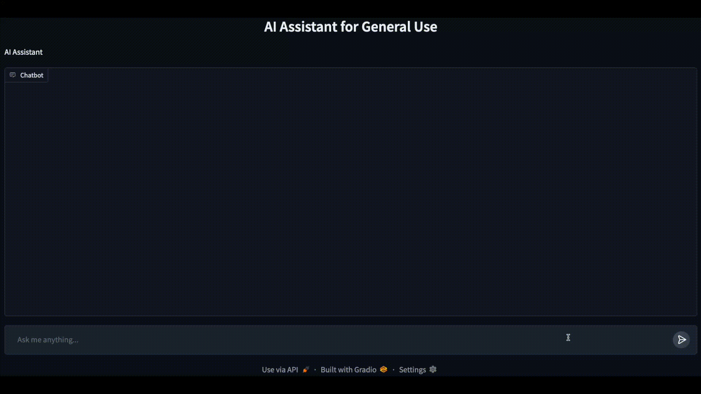

# Gemini-ChatBot

Gemini-ChatBot is a lightweight, Gradio-based web app that allows users to interact with Google's Gemini models through a conversational UI. It leverages Google's Gemini API to provide a seamless chat experience, enabling users to ask questions and receive responses in real time while maintaining conversation history and managing chat memory effectively.

---

## Gradio Demo

Below is a short video demonstrating the chatbot in action within the Gradio UI. Prompts can be entered, and the LLM will respond in real time, maintaining chat memory. The chatbot is designed to be user-friendly, efficient and provides concise responses.



---

## Project Structure

```text
Gemini-ChatBot
├─ README.md
└─ gemini_chatbot
   ├─ chatbot_app.py   # Gradio frontend UI and session management
   ├─ chatbot_backend.py   # Core chatbot class with Gemini API integration
   ├─ config_example.json   # Template config file to be copied and filled with API key and model
   ├─ media
   ├─ requirements.txt   # Python dependencies
   └─ utils.py   # Helper functions
```

---

## Installation
In a virtual environment, e.g. `conda`, with Python 3.13 the project dependencies can be installed as follows:
```bash
cd gemini_chatbot
pip install -r requirements.txt
```

---

## Running the Chatbot App

### Config Setup
Before running the chatbot the configuration file needs to be set up with Google AI Studio API key and the model that will be used.  
The provided template config file `gemini_chatbot/config_example.json` should be copied to `gemini_chatbot/config.json` and edited with the API key and model name.

```json
{
  "GOOGLE_AI_STUDIO_API_KEY": "the-google-ai-studio-api-key",
  "MODEL_NAME": "gemini-2.0-flash-lite"
}
```

Regarding the configuration options:
- `GOOGLE_AI_STUDIO_API_KEY`: The Google Studio API key can be generated from the Google AI Studio platform.
- `MODEL_NAME`: The Google Gemini model to be used for the chatbot. If preferred, another model can be used, e.g. `gemini-2.5-flash-preview-05-20`.

### Running the App
The Gradio App server can be started by running the following command in the terminal from the `gemini_chatbot` directory:
```bash
python chatbot_app.py
```
The app can be accessed by navigating to the following URL in a web browser or the URL that is printed in the terminal (if it differs):
```
http://127.0.0.1:7860
```

#### How It Works
- Uses Google Gemini models for conversational AI
- Google Gemini API is used for LLM calls and for managing conversation state and memory
- The app is built with Gradio for the frontend, providing an interactive chat interface